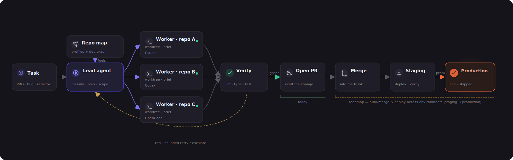
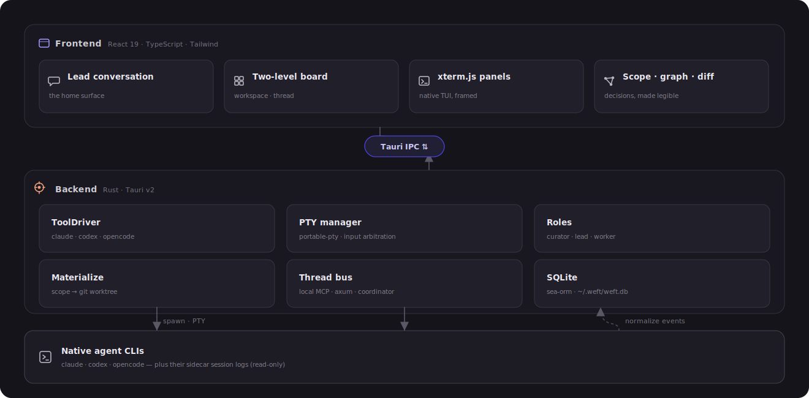
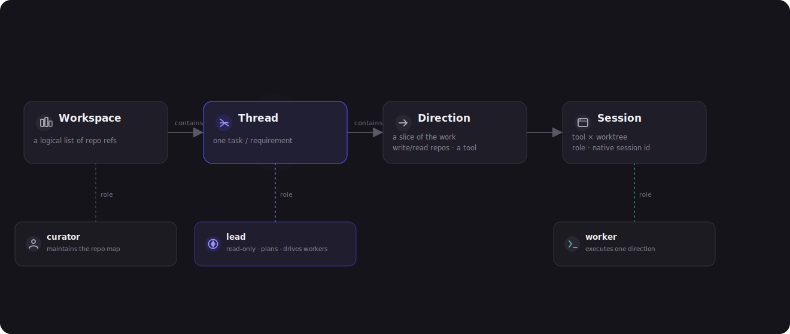

<div align="center">
  

### Local-first delivery hub for coding agents

Give Weft one task, let a lead agent split it into scoped directions, then drive
Claude Code, Codex, or OpenCode workers in isolated git worktrees until there is
a reviewable diff.

<sub>Tauri v2 · React 19 · Rust · SQLite · headless agent sessions</sub>

[中文说明](README.zh-CN.md)
</div>

---

<p align="center">
  
  <br><sub><i>The workspace board shows active issues, their directions, live agent state, checks, and asks.</i></sub>
</p>

## What Weft Is

Weft is a desktop app for running agent work across local repositories. It keeps
your source on your machine, uses native CLIs rather than a remote runtime, and
materializes each approved direction into its own `git worktree`.

The product model is:

- **Workspace**: a logical set of repositories plus profiles, rules, and tools.
- **Issue**: a user-facing work line for a feature, bugfix, refactor, or spike.
- **Direction**: one scoped worker lane, currently with one write repository.
- **Session**: one native agent session attached to a worktree.

The internal store still uses `thread` for the issue-level record. User-facing
docs and UI call that layer an **Issue**.

## How It Works

<p align="center">
  
</p>

1. Add or create repositories in a workspace.
2. Start an issue and discuss the task with the lead agent.
3. The lead proposes directions with write scope, tool choice, reason, and mandate.
4. You approve the write declarations that should become worktrees.
5. Workers run in headless Claude/Codex/OpenCode sessions and stream into Weft's own chat UI.
6. Observe activity, inspect diffs, answer permission asks, and run pre-PR checks.

## Product Surfaces

| Workspace board | Issue board |
|---|---|
|  |  |

| Lead conversation | Repository map |
|---|---|
|  |  |

## Architecture

<p align="center">
  
</p>

The Rust backend owns the local SQLite store, git worktree lifecycle, headless
agent processes, Ask Bridge, local MCP bus, and sidecar observation. The React
frontend renders boards, chat timelines, observe/diff views, settings, and the
Needs-you queue.

<p align="center">
  
</p>

## Current Capabilities

- Local-first Tauri desktop app; no hosted service or account model.
- Workspace repo add/clone/create flows with deterministic repo profiles.
- Claude lead sessions with planner MCP and write-scope review.
- Worker sessions for Claude Code, Codex, and OpenCode.
- Weft-owned chat timeline with queueing, interrupt, resume, slash commands, and attachment handling.
- Ask Bridge for tool permission requests with Allow, Always, Full, and Deny.
- Sidecar observation for Claude jsonl, Codex rollout jsonl, and OpenCode SQLite.
- Diff and pre-PR check surfaces from the materialized worktree.
- Workspace and issue boards, Needs-you queue, settings, inspect views, and English/Chinese UI.

Not yet productized: automatic PR creation, protected-branch merge orchestration,
CI/CD observation, team marketplace sync, and the long-running semantic Curator.

## Development

```bash
npm install
npm run dev          # Vite frontend
npm run build        # TypeScript check + production frontend bundle
npm run tauri dev    # full desktop app
npm run tauri build  # release app bundle
cd src-tauri && cargo test
git diff --check
```

## Project Layout

```text
src/
  board/       workspace and issue boards
  session/     chat, observe, diff, permissions
  components/  shared React UI
  i18n/        English and Chinese strings
src-tauri/src/
  lead_chat/   headless agent session engine
  store/       SQLite/SeaORM entities and migrations
  bus/         local MCP/thread bus
  git.rs       repository and worktree operations
  materialize.rs
assets/
  screenshots/ README screenshots
  diagrams/    architecture and model diagrams
```

## Design Constraints

Weft drives native CLIs through structured, headless interfaces and renders its
own UI. Do not add embedded terminal/TUI dependencies for normal chat surfaces.
Terminal takeover remains an escape hatch for users who want the original CLI.
