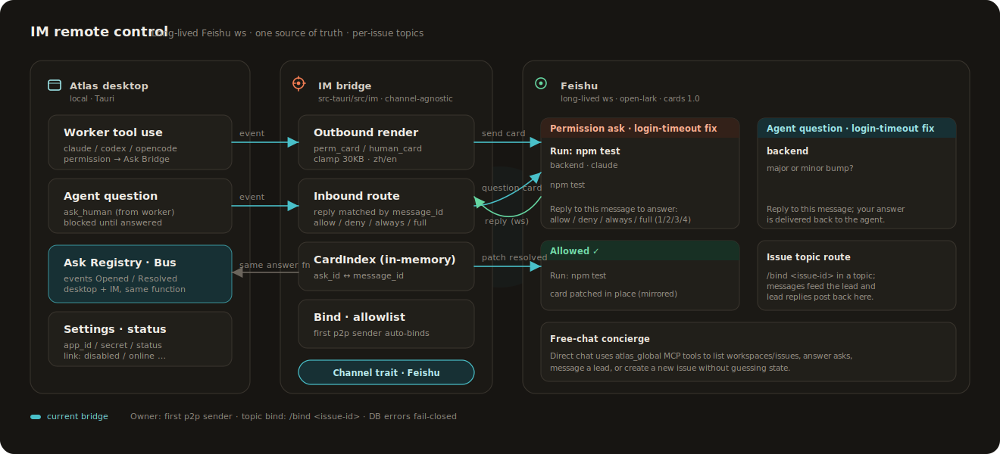

<div align="center">
  

### Local-first delivery hub for coding agents

Give Weft one task, let a lead agent split it into scoped sub-tasks, then drive
Claude Code, Codex, or OpenCode workers in isolated git worktrees until there is
a reviewable diff.

<sub>Tauri v2 · React 19 · Rust · SQLite · headless agent sessions</sub>

[中文说明](README.zh-CN.md)
</div>

---

<p align="center">
  
  <br><sub><i>The workspace board shows active issues, their sub-tasks, live agent state, checks, and asks.</i></sub>
</p>

## What Weft Is

Weft is a desktop app for running agent work across local repositories. It keeps
your source on your machine, uses native CLIs rather than a remote runtime, and
materializes each approved sub-task into its own `git worktree`.

The product model is:

- **Workspace**: a logical set of repositories plus profiles, rules, and tools.
- **Issue**: a user-facing work line for a feature, bugfix, refactor, or spike.
- **Sub-task**: one scoped worker lane, currently with one write repository.
- **Session**: one native agent session attached to a worktree.

The internal store uses `thread` for the Issue layer and `direction` for the
Sub-task layer. User-facing docs and UI call them **Issue** and **Sub-task**.

## How It Works

<p align="center">
  
</p>

1. Add or create repositories in a workspace — or just open the lead and let it
   render an action card to add / clone / create one when no repos exist yet.
2. Start an issue and discuss the task with the lead agent.
3. The lead proposes sub-tasks with write scope, tool choice, reason, and mandate.
4. You approve the write declarations that should become worktrees.
5. Workers run in headless Claude/Codex/OpenCode sessions and stream into Weft's own chat UI.
6. Observe activity, inspect diffs, answer permission asks (in the app or via IM), and run pre-PR checks.

## Product Surfaces

| Workspace board | Issue board |
|---|---|
|  |  |

| Lead conversation | Repository map |
|---|---|
|  |  |

## Architecture

<p align="center">
  
</p>

The Rust backend owns the local SQLite store, git worktree lifecycle, headless
agent processes, Ask Bridge, local MCP bus, and sidecar observation. The React
frontend renders boards, chat timelines, observe/diff views, settings, and the
Needs-you queue.

<p align="center">
  
</p>

## IM Remote Control

<p align="center">
  
</p>

Permission asks and agent questions raised by workers mirror to a long-lived
Feishu websocket as interactive cards. Replying to a card answers it through the
same function the desktop UI uses — both surfaces stay in sync (the card patches
to its resolved state regardless of where you answered). First p2p sender
auto-binds as owner; group messages can never trigger binding; DB errors are
fail-closed.

Beyond cards, the bridge carries three surfaces end-to-end:

- **Issue threads.** Bind an issue (`thread_id`) to a Feishu thread via the
  desktop's Settings → IM → Routes panel. Group messages in that thread are
  routed into the issue's lead engine and the lead's replies post back to the
  same thread (with a 👀 reaction held until the lead actually responds, so the
  IM side sees real backpressure instead of silence).
- **Concierge (single-chat).** Any free-text DM to the bot is routed into a
  Concierge lead engine that has the `weft_global` MCP server attached
  (`list_workspaces / list_issues / pending_needs_you / issue_status /
  answer_permission / answer_question / message_lead / create_issue`). The
  Concierge verifies state with tools before answering and only acts on the
  human's behalf when they explicitly consent (irreversible decisions stay
  on the desktop).
- **Online resync.** Each time the bridge transitions to *online* (initial
  start or after a settings/credential bump), it sends the owner a one-shot
  summary of every pending Needs-you so nothing silently piles up while you
  were away. Reconnect-within-the-same-generation does not re-fire.

## Current Capabilities

- Local-first Tauri desktop app; no hosted service or account model.
- Workspace repo add/clone/create flows with deterministic repo profiles.
- Claude lead sessions with planner MCP and write-scope review.
- Lead-driven onboarding: the system prompt carries a live `<repo_state>` snapshot,
  and the lead can render in-chat action cards (`<weft:action_card>`) to add,
  clone, or create a repo without leaving the conversation.
- Worker sessions for Claude Code, Codex, and OpenCode.
- Weft-owned chat timeline with queueing, interrupt, resume, slash commands, and attachment handling.
- Ask Bridge for tool permission requests with Allow, Always, Full, and Deny.
- IM bridge (Feishu): mirror permission asks and agent questions to a long-lived
  Lark websocket as interactive cards; reply on mobile to resolve them. First
  private-chat sender auto-binds; settings live in `app_setting` and the bridge
  is fail-closed. Issue ↔ Feishu thread binding (lead messages flow both ways),
  a Concierge single-chat helper backed by the `weft_global` MCP, and a one-shot
  resync summary on every (re)online transition.
- Skill source manager: register git-backed skill repos, sync on demand, and
  toggle individual skills on globally or per-workspace.
- Sidecar observation for Claude jsonl, Codex rollout jsonl, and OpenCode SQLite.
- Diff and pre-PR check surfaces from the materialized worktree.
- Rename / cascade-delete for workspaces, issues, and sub-tasks (display-only;
  slugs and branches stay stable).
- Workspace and issue boards, Needs-you queue, settings, inspect views, and English/Chinese UI.

Not yet productized: automatic PR creation, protected-branch merge orchestration,
CI/CD observation, team marketplace sync, and the long-running semantic Curator.

## Development

```bash
npm install
npm run dev          # Vite frontend
npm run build        # TypeScript check + production frontend bundle
npm run tauri dev    # full desktop app
npm run tauri build  # release app bundle
cd src-tauri && cargo test
git diff --check
```

## Project Layout

```text
src/
  board/                workspace and issue boards
  session/              chat, observe, diff, permissions
    blocks/             chat-timeline rich blocks (e.g. ActionCardBlock)
    useRepoActions.ts   add / clone / create repo from a lead action card
  components/           shared React UI
  i18n/                 English and Chinese strings
src-tauri/src/
  lead_chat/            headless agent session engine
    sentinels.rs        parse <weft:action_card> / <weft:list_repos/> markers
    repo_state.rs       <repo_state> snapshot injected into the lead's prompt
  im/                   IM bridge (Channel trait + Feishu adapter, ws + cards)
  store/                SQLite/SeaORM entities and migrations
  bus/                  local MCP/thread bus + human-ask notifier
  ask.rs                permission Ask registry (desktop + IM mirrored)
  git.rs                repository and worktree operations
  materialize.rs
assets/
  screenshots/          README screenshots
  diagrams/             architecture and model diagrams
```

## Design Constraints

Weft drives native CLIs through structured, headless interfaces and renders its
own UI. Do not add embedded terminal/TUI dependencies for normal chat surfaces.
Terminal takeover remains an escape hatch for users who want the original CLI.
