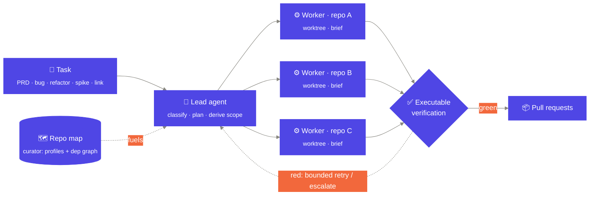
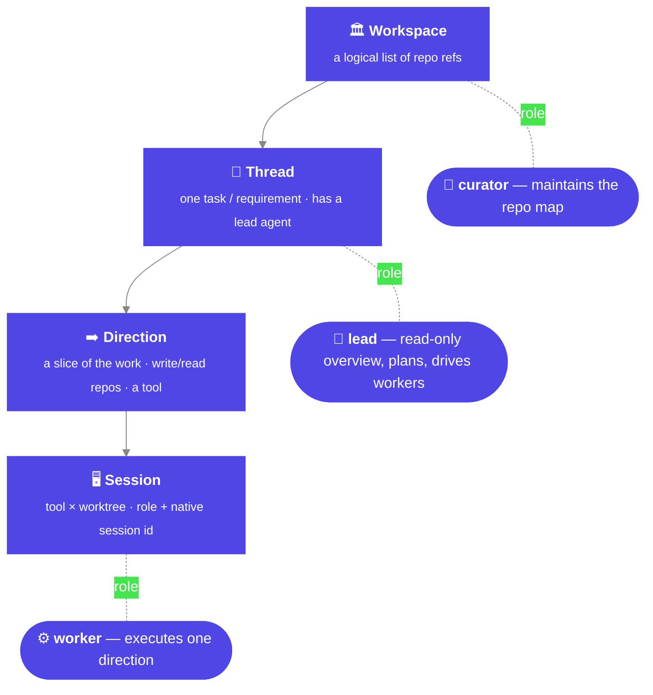
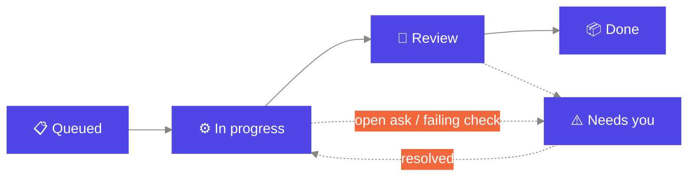
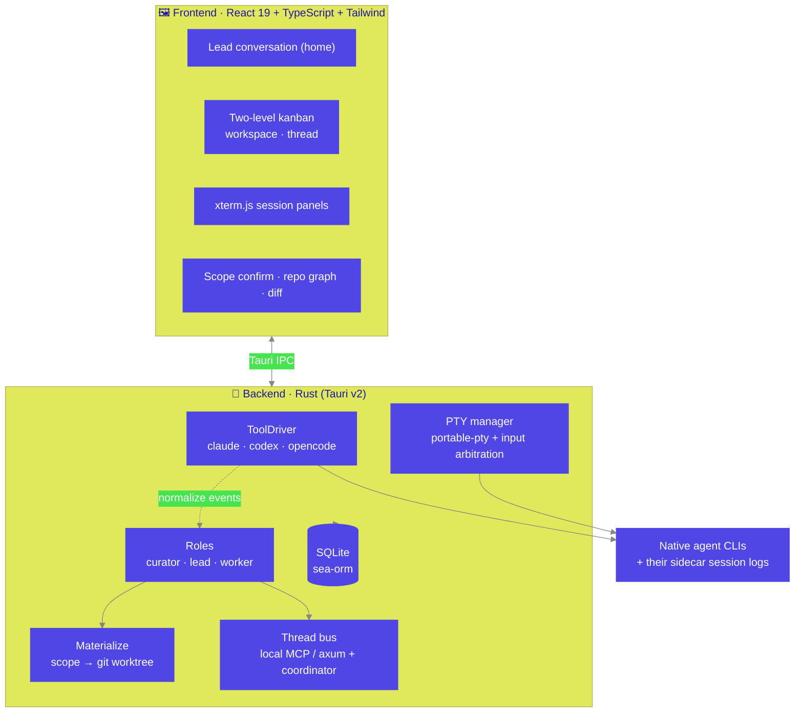

<div align="center">


### Coding agents that carry multi-repo work from a task to a PR

**Local-first · no server · automation-first**

[简体中文](README.zh-CN.md) · **English**

<sub>Tauri v2 · React 19 · Rust · SQLite · xterm.js</sub>

</div>

---

> **Weft** is a local-first desktop delivery hub where coding agents (Claude Code,
> Codex, OpenCode) drive work across **several repositories at once** — from a
> stated **Task** all the way to **clean pull requests**. You state the intent;
> Weft plans it, decides which repos to touch, spawns the agents, coordinates
> them, verifies the result, and opens the PRs. **You supervise and handle
> exceptions — you are not a required checkpoint in the loop.**

It is explicitly *not* a terminal emulator, and not a "watch the agents go"
dashboard. It is the **workspace-and-automation fabric** the agents deliver inside.

---

## The idea in one picture

A single workspace is a logical list of repo references. One **Task** fans out
into parallel **directions**, each running in its own isolated git worktree, each
driven by an agent — and converges back into pull requests.



---

## Why it's different

Most agent tools chat, or drive **one** repo. Weft's irreplaceable moment is
**cross-repo scope decomposition**: turning *one* task into *"these repos, this
split, in this order — and who does what."*

| | Most agent tools | **Weft** |
|---|---|---|
| **Unit of work** | a chat / one repo | a **Task** spanning many repos |
| **Decomposition** | you split it by hand | the **lead** derives scope from a live repo map |
| **Isolation** | one working tree | a **git worktree per write-repo**, lazily materialized |
| **Human role** | drive every step | **supervise**; act only on exceptions |
| **Quality gate** | a human nod | **executable verification** (lint · type · test · contract) |
| **Boundary** | open-ended | **Task → PR** — merge/CI/release stay with your repo's harness |
| **The agent CLIs** | re-wrapped / proxied | **native CLIs, verbatim** — hooks, skills, permissions intact |

---

## The model

Weft's structure *is* the product. Four nested layers, with sessions carrying a
**role**:



- **Curator** profiles each repo (one-line role, interfaces, stack) and builds the
  cross-repo dependency graph — the fuel for scope decomposition.
- **Lead** is *home*: a read-only conversation + control tower. It plans, derives
  scope, spawns workers, and drives them to convergence over a per-thread bus.
  **It never writes code, and never ingests a worker's raw transcript** — workers
  report structured summaries + diff stats.
- **Worker** executes one direction inside its own worktree, with a structured
  **brief** (scope + interface contract + acceptance).

---

## The board — a live trust dashboard

Because no human gates the work, the board isn't a to-do list you drag — it's a
**live projection of agent + git + check state**. Cards move through the lifecycle
on their own; you act only on the ones that surface.

It's **two levels, zoom-linked**:

- **Workspace board** — one card per **thread**, the whole portfolio at a glance.
  Each card shows its kind, direction count, what's **live** (running, pulsing),
  what's **failing**, and a **needs-you** badge.
- **Thread board** — one card per **direction / task**, drilled into a single work
  line, with a **Board ↔ Lead** tab to switch between the cards and the lead
  conversation.



- **"Needs you" is the exception lane Weft owns.** Whatever a task's stored status,
  an **open permission ask** or a **failing check** overlays it into *Needs you* —
  aggregated across every thread and surfaced at the very top of every view. When
  nothing is waiting, it's quietly empty.
- **Cards carry their acceptance signals** (running sessions, failing checks) so
  green you trust and red you open — provenance you can expand, not a bare label.
- **The human acts, not babysits.** Your verbs are Approve / Answer / Open /
  Review — plus drag-to-restatus a task between columns when you want to override
  what the agents inferred.

---

## Principles (non-negotiable)

1. **Automation is the north star.** Default path is autonomous: task in, PRs out.
   Every surface is built for *supervising* the flow, not driving it step by step.
2. **The human handles exceptions, not the line.** Weft adds **no approval gate of
   its own**. The only blocking interruptions are the tools' own permission prompts
   (passed through verbatim, never overridden) plus a configurable irreversible-action
   boundary. "What's waiting on me" is the rare exception, surfaced at the top.
3. **Drive native CLIs, never re-draw them.** Spawn `claude` / `codex` / `opencode`
   as plain binaries under the user's own config — preserving hooks, skills, and
   permissions. The native TUI runs verbatim in a PTY; Weft *frames* it.
4. **Cross-repo wiring is ephemeral.** Sibling repos are mounted read-only via
   temporary launch args (`--add-dir`); never written into a canonical repo's config.
5. **Hide the mechanism, present the decisions.** Worktrees / PTY / MCP bus / sidecar
   recede into **Inspect**. The task, scope, branch/PR/diff, tool choice, and brief
   stay first-class — every abstraction ships with a real escape hatch.
6. **Bilingual from day one.** zh / en, two layers — UI strings *and* agent output
   language. Internal state enums stay English; code/identifiers always English.

---

## Architecture



**Locked stack** — Tauri v2 (Rust + React/TS/Vite) · PTY via `portable-pty` +
`xterm.js` · state in SQLite (sea-orm) · git worktrees driven by the system `git` ·
i18n via `react-i18next`.

---

## Getting started

> **Prerequisites:** [Node.js](https://nodejs.org) 18+, the
> [Rust toolchain](https://rustup.rs), and the platform deps for
> [Tauri v2](https://v2.tauri.app/start/prerequisites/). To actually drive agents
> you'll want one or more of the [Claude Code](https://claude.com/claude-code),
> [Codex](https://github.com/openai/codex), or
> [OpenCode](https://opencode.ai) CLIs installed.

```bash
# install frontend deps
npm install

# run the desktop app in dev (Vite + Tauri)
npm run tauri dev

# build a release bundle
npm run tauri build
```

Frontend-only iteration without the Rust shell:

```bash
npm run dev        # Vite dev server
npm run build      # type-check + production build
```

Backend tests:

```bash
cd src-tauri && cargo test
```

---

## Project layout

```
src/                  React frontend
  board/              two-level kanban, repo graph, scope confirm, needs-you, bus
  session/            lead tab, transcript, diff views
  panels/             xterm.js terminal panels
  nav/  components/    workspace nav, dialogs, UI primitives, Inspect
  i18n/               en / zh resources + runtime switch
src-tauri/src/        Rust backend
  drivers/            ToolDriver: claude · codex · opencode + sidecar parsing
  pty.rs              PTY sessions + input arbitration
  roles/curator/lead  survey · scope · brief · dispatch · worker mandate
  bus/                thread bus (MCP / axum server) + coordinator injection
  materialize.rs      scope → worktree + add-dir wiring
  store/              SQLite schema + repositories
ARCHITECTURE.md       full design & feasibility study
PRODUCT.md  DESIGN.md the product brief and the visual system
```

---

## Status

Weft is in **active development**. The vertical slices defined in
[`CLAUDE.md`](CLAUDE.md) — single-tool end-to-end (M1), worktree orchestration +
data model (M2), three drivers + surfaces (M3), session interaction layer (M4),
lead/worker + lazy scope (M5), and the two-level agent-first board + config
delivery + i18n (M6) — are implemented or in progress. Current focus is
simplifying scope to a label-free, lazy-materialization model.

The deep design is in [`ARCHITECTURE.md`](ARCHITECTURE.md); the product thesis in
[`PRODUCT.md`](PRODUCT.md); the visual system in [`DESIGN.md`](DESIGN.md).

---

<div align="center">
<sub>Composed, exact, quietly alive. — Weft</sub>
</div>
