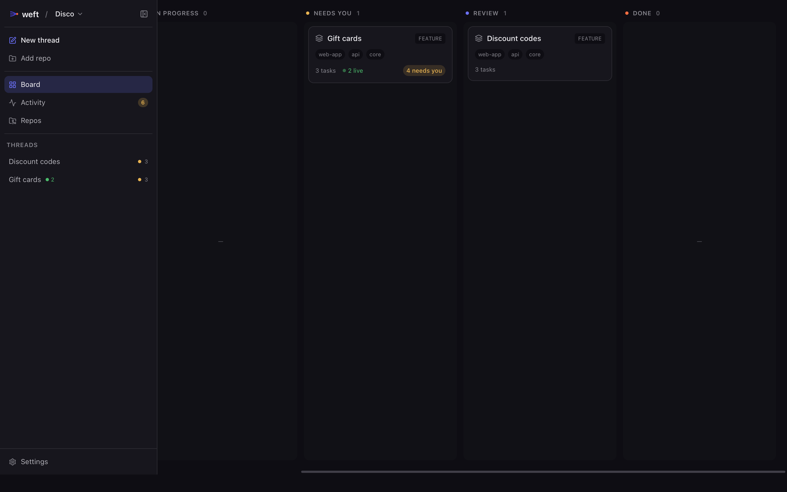
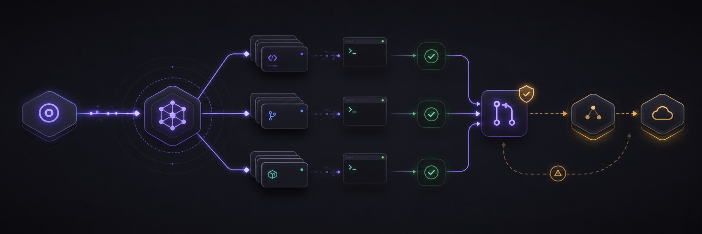
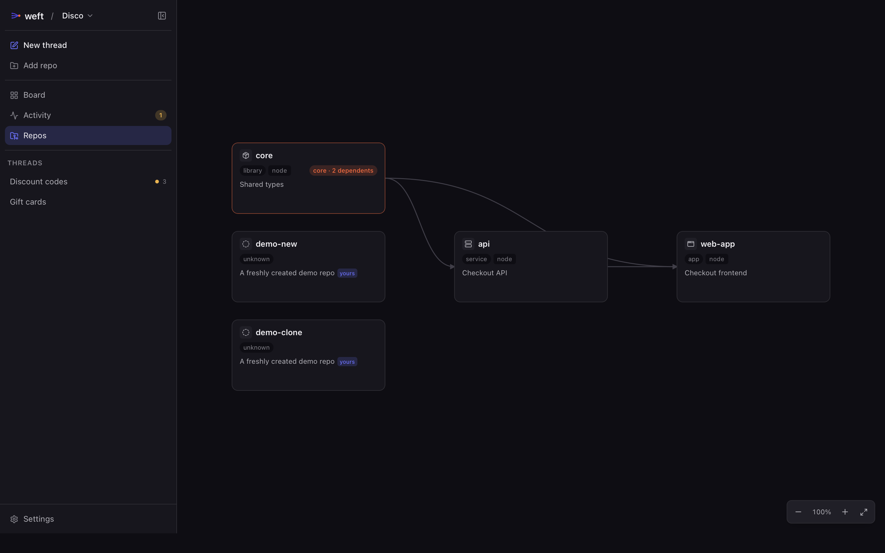
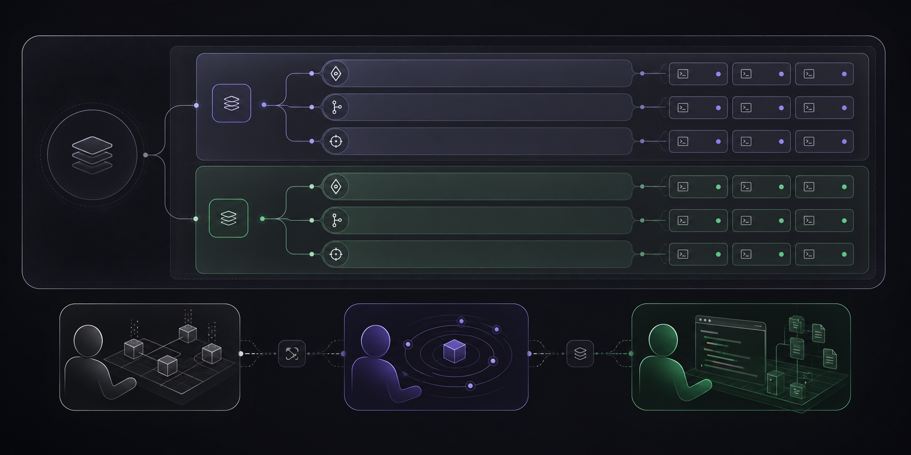
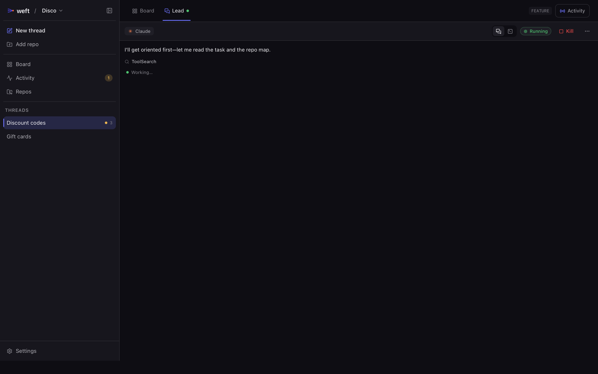
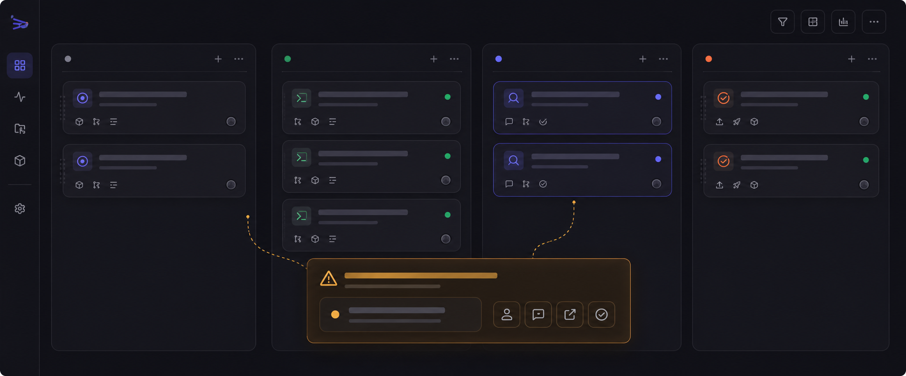
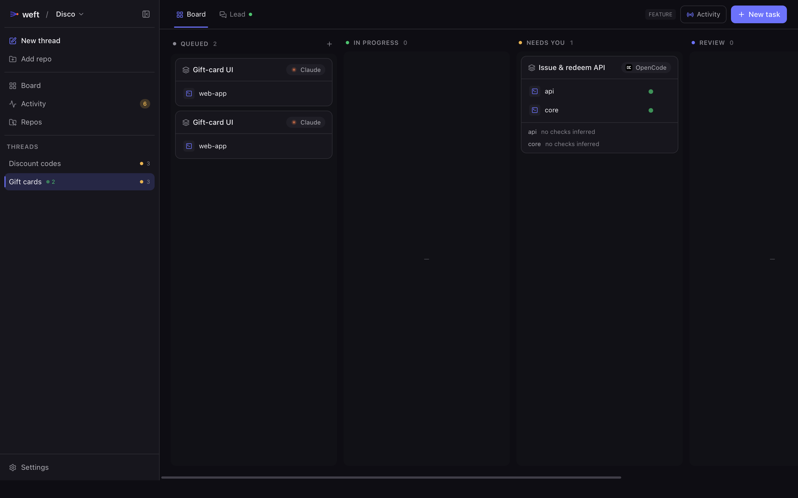
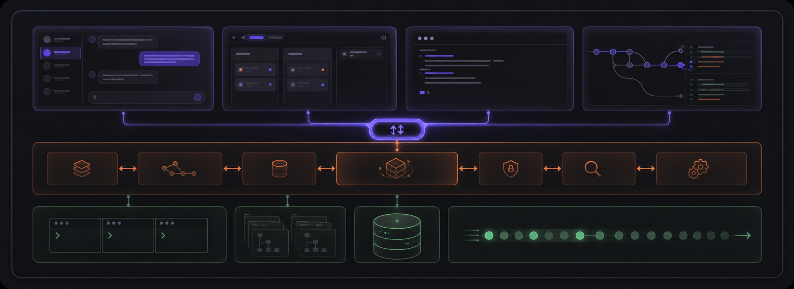

<div align="center">


### Local-first delivery hub for coding agents

Give Weft one task. It coordinates your own Claude Code, Codex, and OpenCode across multiple repositories until the work becomes reviewable, mergeable code.

**local-first · no server · automation-first**

[简体中文](README.zh-CN.md) · **English**

<sub>Tauri v2 · React 19 · Rust · SQLite · xterm.js</sub>

</div>

---

> **Weft** is a local-first desktop delivery hub for multi-repo software work.
> You describe a **Task**; Weft plans the scope, decides which repositories need
> changes, starts native coding-agent CLIs, coordinates their work, and verifies
> the result. **You supervise the flow and handle exceptions. You are not a
> required checkpoint for every step.**
>
> Today, Weft drives each affected repository toward a clean Pull Request. The
> longer-term direction is to keep going after the PR: merge, then deploy through
> the environments your repositories already use, from staging to production.

Weft is not a terminal emulator, and it is not a dashboard for watching agents
scroll. It is the local workspace and automation layer where agents turn one
intent into coordinated delivery across repositories.

<p align="center">
  
  <br><sub><i>The workspace board: each thread is a live card showing what is running, what failed, and what needs you.</i></sub>
</p>

---

## How It Works

A workspace is a logical set of repository references. One **Task** is decomposed
into parallel **directions**. Each direction runs in its own isolated git
worktree, driven by a worker agent, and all directions converge toward a
reviewable result. Today the result is a PR per repository; the roadmap extends
that flow through merge and environment-aware deployment.

<p align="center">
  
</p>

---

## Why Weft Exists

Most agent tools are built around a chat session or a single repository. Weft is
built around **cross-repo scope decomposition**: turning one task into "these
repositories, this split of work, this order, and this agent for each part."

| | Most agent tools | **Weft** |
|---|---|---|
| **Unit of work** | A chat or one repository | One **Task** spanning many repositories |
| **Scope** | You split the work by hand | The **Lead** derives scope from a live repository map |
| **Isolation** | One working tree | One **git worktree** per write repository, created only when needed |
| **Human role** | Drive each step | **Supervise**; intervene only on exceptions |
| **Quality gate** | Human judgment | **Executable verification**: lint · type · test · contract |
| **Delivery target** | Open-ended output | PRs today; merge and deploy are the roadmap |
| **Agent CLIs** | Wrapped or proxied | **Native CLIs** with hooks, skills, and permissions intact |

<p align="center">
  
  <br><sub><i>The curator's cross-repo dependency map: repository roles, stacks, and relationships such as "core · N dependents". This is the input for scope decomposition.</i></sub>
</p>

---

## Core Model

Weft is organized around four nested layers. Sessions carry an explicit role, so
planning, coordination, and implementation stay separate.

<p align="center">
  
</p>

<p align="center">
  
  <br><sub><i>Home is the Lead conversation. The Lead reads across repositories, plans the work, and drives workers. Board / Lead tabs switch between the live board and the coordinating conversation.</i></sub>
</p>

- **Curator** profiles each repository with its role, interfaces, and stack, then
  builds the cross-repo dependency map used for decomposition.
- **Lead** is the main conversation and control tower. It reads repositories,
  derives scope, starts workers, and coordinates them over a thread bus. **It
  never writes code and never consumes raw worker transcripts**; workers report
  structured summaries and diff stats.
- **Worker** executes one direction in its own worktree from a structured
  **brief** containing scope, interface contracts, and acceptance criteria.

---

## Board As Trust Surface

Because Weft does not put a human gate in front of every step, the board is not a
manual to-do list. It is a live projection of agent state, git state, and check
state. Cards move through the lifecycle automatically; you act on the exceptions
that surface.

The board has two levels:

- **Workspace board**: one card per **thread**, giving a portfolio view of the
  workspace. Cards show task kind, direction count, running work, failing checks,
  and whether anything **Needs you**.
- **Thread board**: one card per **direction / task**, focused on a single line
  of work. The **Board ↔ Lead** tabs switch between the cards and the Lead
  conversation.

<p align="center">
  
</p>

<p align="center">
  
  <br><sub><i>A thread board: directions move through the lifecycle, each tagged with its tool and live status. An open ask or failing check moves a card into <b>Needs you</b>.</i></sub>
</p>

- **Needs you is the exception lane.** Any open permission request or failing
  check is surfaced there, regardless of the task's stored status. It is
  aggregated across threads and shown at the top of every view.
- **Cards carry evidence.** Running sessions, failing checks, and verification
  provenance are expandable. Green should be trustworthy; red should be
  actionable.
- **The human acts, not babysits.** The main verbs are Approve, Answer, Open,
  and Review. Manual drag-to-status remains available when you want to override
  what the agents inferred.

---

## Product Principles

1. **Automation is the direction.** The default path is autonomous: task in,
   deliverable code out. Interfaces are built for supervising the flow, not
   pushing every step.
2. **Humans handle exceptions, not the assembly line.** Weft adds no approval
   gate of its own. Blocking prompts come from the native tools or from a
   configurable irreversible-action boundary such as protected-branch merge or
   production deployment.
3. **Run native CLIs, do not redraw them.** Weft starts `claude`, `codex`, and
   `opencode` as normal binaries under the user's own configuration, preserving
   hooks, skills, and permissions. Native TUIs run in a PTY; Weft hosts and
   coordinates them.
4. **Keep cross-repo wiring temporary.** Sibling repositories are mounted
   read-only through launch arguments such as `--add-dir`; Weft does not write
   that wiring into a canonical repository's config.
5. **Hide mechanisms, show decisions.** Worktrees, PTYs, the MCP bus, and
   sidecars live under **Inspect**. Task, scope, branch, PR, diff, tool choice,
   and brief stay first-class.
6. **Bilingual from the start.** UI text and agent-output language are both
   language-aware. Internal state enums stay English; code and identifiers stay
   English.

---

## Architecture

<p align="center">
  
</p>

**Locked stack**: Tauri v2 (Rust + React / TypeScript / Vite) ·
`portable-pty` + `xterm.js` · SQLite (sea-orm) · system `git worktree` ·
`react-i18next`.

---

## Getting Started

> **Prerequisites:** [Node.js](https://nodejs.org) 18+, the
> [Rust toolchain](https://rustup.rs), and the platform dependencies for
> [Tauri v2](https://v2.tauri.app/start/prerequisites/). To drive agents, install
> one or more of the [Claude Code](https://claude.com/claude-code),
> [Codex](https://github.com/openai/codex), or
> [OpenCode](https://opencode.ai) CLIs.

```bash
# install frontend dependencies
npm install

# run the desktop app in development mode (Vite + Tauri)
npm run tauri dev

# build a release bundle
npm run tauri build
```

Frontend-only iteration without the Rust shell:

```bash
npm run dev        # Vite dev server
npm run build      # type-check + production build
```

Backend tests:

```bash
cd src-tauri && cargo test
```

---

## Project Layout

```text
src/                  React frontend
  board/              two-level board, repo graph, scope confirm, Needs you, bus
  session/            Lead tab, transcript, diff views
  panels/             xterm.js terminal panels
  nav/  components/    workspace nav, dialogs, UI primitives, Inspect
  i18n/               en / zh resources and runtime switching
src-tauri/src/        Rust backend
  drivers/            ToolDriver: claude · codex · opencode + sidecar parsing
  pty.rs              PTY sessions and input arbitration
  roles/curator/lead  survey · scope · brief · dispatch · worker mandate
  bus/                thread bus (MCP / axum server) + coordinator injection
  materialize.rs      scope → worktree + add-dir wiring
  store/              SQLite schema and repositories
ARCHITECTURE.md       full design and feasibility study
PRODUCT.md  DESIGN.md product thesis and visual system
```

---

## Status

Weft is in **active development**. The vertical slices in
[`CLAUDE.md`](CLAUDE.md) are implemented or in progress: single-tool
end-to-end (M1), worktree orchestration and data model (M2), three drivers and
surfaces (M3), session interaction layer (M4), Lead / Worker with lazy scope
(M5), and the two-level agent-first board with config delivery and i18n (M6).
The current focus is simplifying scope into a label-free, lazy-materialized
model.

**Roadmap boundary.** Today, delivery stops at a PR per affected repository. The
longer-term target is to continue through auto-merge and environment-aware
deployment, so "done" means shipped code rather than an open PR. That is the
roadmap, not the current behavior.

For deeper context, see [`ARCHITECTURE.md`](ARCHITECTURE.md), [`PRODUCT.md`](PRODUCT.md),
and [`DESIGN.md`](DESIGN.md).

---

<div align="center">
<sub>Composed, exact, quietly alive. — Weft</sub>
</div>
