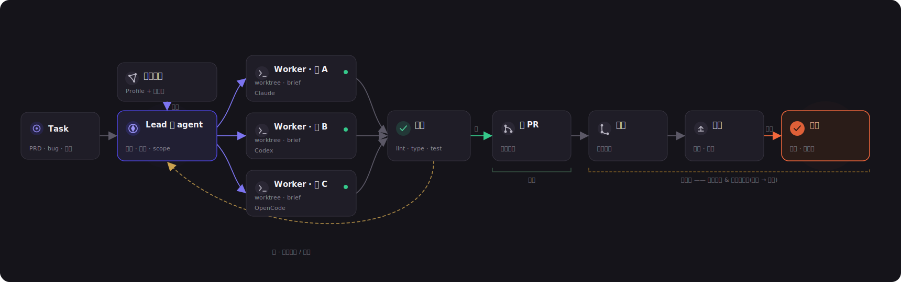
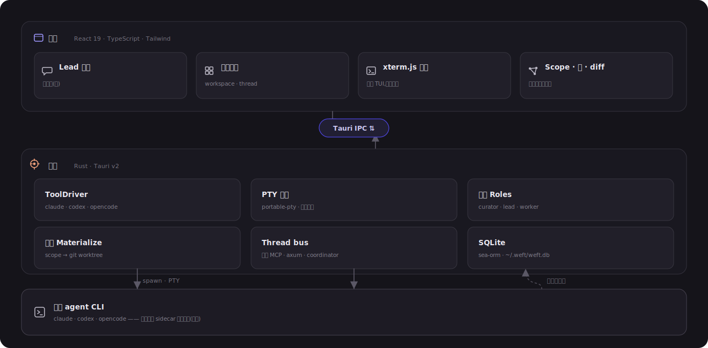
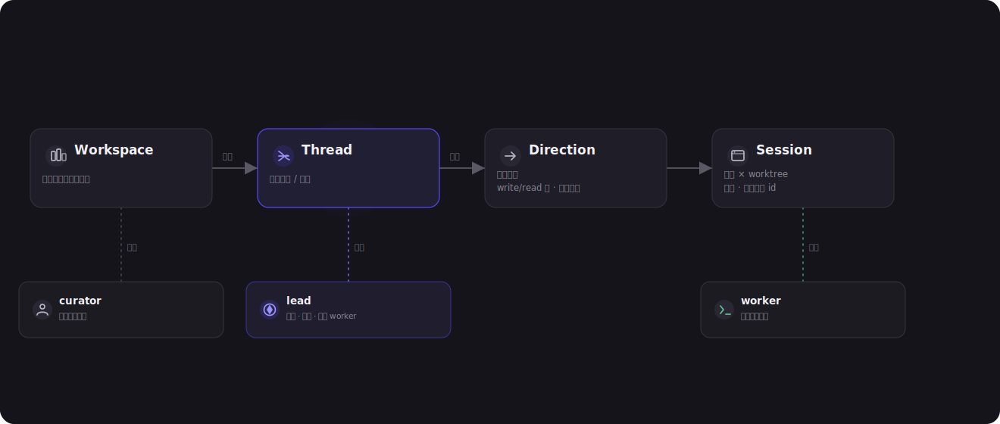

<div align="center">
  

### 本地优先的 Coding Agent 交付工作台

把一个任务交给 Weft，由 Lead agent 拆成明确写入范围的方向，再驱动
Claude Code、Codex 或 OpenCode worker 在隔离的 git worktree 里推进到可 review 的 diff。

<sub>Tauri v2 · React 19 · Rust · SQLite · headless agent sessions</sub>

[English](README.md)
</div>

---

<p align="center">
  
  <br><sub><i>Workspace 看板展示进行中的 Issue、方向、agent 状态、检查结果和需要你处理的事项。</i></sub>
</p>

## Weft 是什么

Weft 是一个面向本地多仓开发的桌面应用。源码留在你的机器上，运行的是你已经登录过的原生 CLI，不依赖远端 runtime；每个被批准的执行方向都会物化成独立的 `git worktree`。

产品模型是：

- **Workspace**：一组逻辑仓库，以及仓库画像、规则和工具配置。
- **Issue**：面向用户的工作线，可以是 feature、bugfix、refactor 或 spike。
- **Direction**：一个具体 worker 方向，目前绑定一个写入仓库。
- **Session**：一个原生 agent 会话，绑定到某个 worktree。

内部存储仍使用 `thread` 表示 Issue 这一层。面向用户的文档和 UI 统一称为 **Issue**。

## 工作流

<p align="center">
  
</p>

1. 在 Workspace 中添加、克隆或创建仓库。
2. 新建 Issue，并和 Lead agent 讨论任务。
3. Lead 提出 directions，包含写入范围、工具选择、原因和执行授权。
4. 你确认哪些写入声明可以创建 worktree。
5. Worker 以 headless Claude/Codex/OpenCode 会话运行，并流式进入 Weft 自己的 chat UI。
6. 你可以观察活动、查看 diff、处理权限请求，并运行 pre-PR checks。

## 产品界面

| Workspace 看板 | Issue 看板 |
|---|---|
|  |  |

| Lead 对话 | 仓库地图 |
|---|---|
|  |  |

## 架构

<p align="center">
  
</p>

Rust 后端负责本地 SQLite 状态库、git worktree 生命周期、headless agent 进程、Ask Bridge、本地 MCP bus 和 sidecar 观测。React 前端负责看板、chat timeline、Observe/Diff、Settings、Inspect 和 Needs-you 队列。

<p align="center">
  
</p>

## 当前能力

- 本地优先 Tauri 桌面应用，无托管服务和账号系统。
- Workspace 仓库 add/clone/create，以及确定性 Repo Profile。
- Claude Lead 会话，带 planner MCP 和写入范围确认。
- Claude Code、Codex、OpenCode worker 会话。
- Weft 自有 chat timeline，支持排队、打断、resume、slash commands 和附件。
- Ask Bridge 统一展示工具权限请求，支持 Allow、Always、Full、Deny。
- sidecar 观测 Claude jsonl、Codex rollout jsonl 和 OpenCode SQLite。
- 从物化 worktree 直接展示 diff 和 pre-PR checks。
- Workspace/Issue 看板、Needs-you、Settings、Inspect，以及中英双语 UI。

尚未产品化：自动创建 PR、受保护分支合并编排、CI/CD 观测、团队 marketplace 同步、长期语义 Curator。

## 本地开发

```bash
npm install
npm run dev          # Vite 前端
npm run build        # TypeScript 检查 + 生产前端 bundle
npm run tauri dev    # 完整桌面应用
npm run tauri build  # release app bundle
cd src-tauri && cargo test
git diff --check
```

## 目录结构

```text
src/
  board/       Workspace 和 Issue 看板
  session/     chat、observe、diff、权限请求
  components/  共享 React UI
  i18n/        英文和中文文案
src-tauri/src/
  lead_chat/   headless agent 会话引擎
  store/       SQLite/SeaORM entities 与 migrations
  bus/         本地 MCP/thread bus
  git.rs       仓库和 worktree 操作
  materialize.rs
assets/
  screenshots/ README 截图
  diagrams/    架构图和模型图
```

## 设计约束

Weft 通过结构化的 headless 接口驱动原生 CLI，并渲染自己的产品 UI。正常 chat surface 不再引入嵌入式终端/TUI 依赖；“在终端接管”仍作为原生 CLI 逃生舱保留。
